# AI Vet Triage Chatbot — Multi-Agent Architecture

**Scope: cats only.** Every prompt, the triage knowledge base, and the test suite are
written for feline presentation specifically. See [§10](#10-cat-specific-health-scenarios-demo-set)
for why that isn't just a wording choice — several symptoms mean something materially
different in a cat than in a dog — and `turn_processor.py` for the out-of-scope redirect
that fires when a message clearly describes another animal.

> Section numbers in this document are referenced from docstrings throughout the
> backend (e.g. *"README section 3"* in `turn_processor.py`). They are stable — add
> new sections at the end rather than renumbering.

---

## System at a glance

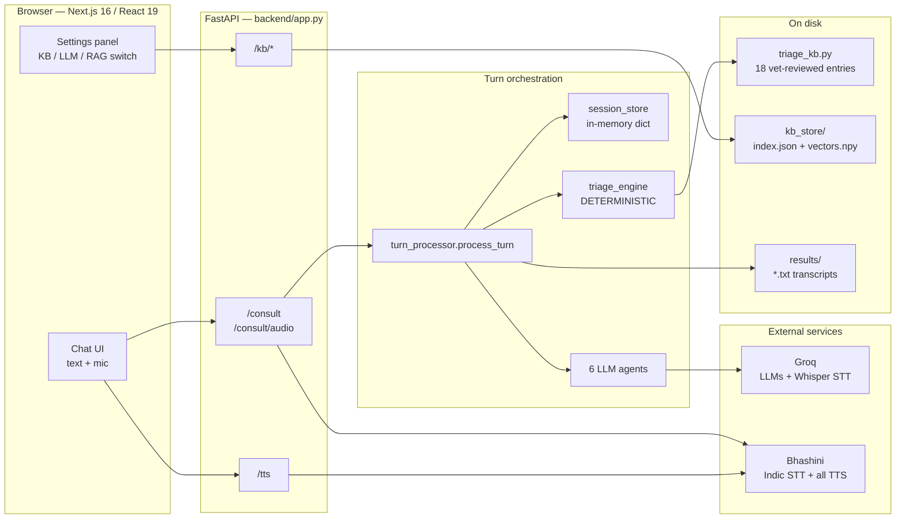

The one rule the whole design exists to enforce: **the LLMs handle language, the
deterministic engine handles urgency.** Everything below is a consequence of that.

---

## Repository map

```
backend/
  app.py               FastAPI app — every HTTP endpoint (§7)
  turn_processor.py    One conversation turn, start to finish (§3)
  session_store.py     In-memory session state (§4)
  triage_engine.py     classify_urgency() — the deterministic decision (§1)
  triage_kb.py         18 vet-reviewed cat entries + symptom aliases (§4.1, §10)
  agents/
    orchestrator.py    Route this turn: triage or knowledge
    intake.py          Free text -> structured symptom fields
    conversation.py    Clarifying question / final reply phrasing
    safety.py          Guardrail pass over the draft reply
    note.py            SOAP consultation note (§11)
    knowledge.py       General Q&A: kb / llm / rag modes (§5, §8)
  groq_client.py       One shared Groq client for all agents + English STT
  bhashini_client.py   Indic STT + all TTS over Bhashini's pipeline API
  stt_router.py        ffmpeg normalize, then pick the STT provider by language
  speech_errors.py     Shared SpeechServiceError for both STT/TTS providers
  transcript.py        save_conversation() -> results/*.txt (§6)
  rag_store.py         Upload -> chunk -> embed -> retrieve (§8)
  models.py            Pydantic request/response schemas
  config.py            Env-driven model IDs, thresholds, paths
  scripts/seed_kb.py   Ingest knowledge_docs/ into the RAG store
  knowledge_docs/      13 original cat-care markdown documents
  kb_store/            RAG store: index.json + vectors.npy
  results/             Saved plain-text session transcripts
  tests/               test_triage_engine.py, test_orchestrator.py

frontend/
  app/page.tsx                  Composes Header / MessageList / Composer / SettingsPanel
  hooks/useTriageChat.ts        Session id, message list, urgency, audio playback
  hooks/useVoiceRecorder.ts     MediaRecorder -> audio/webm blob
  components/SettingsPanel.tsx  KB upload/list/delete + KB|LLM|RAG ask box
  lib/api.ts, lib/types.ts      Typed fetch wrappers mirroring models.py
```

---

## 1. Design principle before anything else

In an agent framework it is tempting to make everything "an agent." Don't.
**Only the conversational and reasoning parts are LLM agents. The urgency decision is
a deterministic function**, called *by* an agent as a tool, never decided *by* an
agent's judgment.

`triage_engine.classify_urgency()` makes no network call and reads nothing at runtime
except the in-code `TRIAGE_KB`. That is what makes it independently testable
(`tests/test_triage_engine.py`) and auditable: if a vet approves "vomiting → these
red flags", that exact entry fires every time, for every user, in every language.

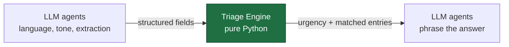

Everything an LLM produces in this system is either *input to* or *a rendering of*
that middle box. No agent can talk its way around it.

---

## 2. Agent roster

| Agent | Type | Job | Owns |
|---|---|---|---|
| **Orchestrator** | LLM (light) | Routes the turn to triage or knowledge | Conversation flow, not medical content |
| **Intake** | LLM | Extracts species, symptom, duration, severity cues, breed, age from free text | Turning messy speech into structured data |
| **Triage Engine** | **Deterministic function** | Structured fields → urgency + matched KB entries + missing info | The safety-critical decision |
| **Conversation** | LLM | Asks ONE clarifying question, or phrases the final reply in the user's language | Tone, clarity, language |
| **Safety** | LLM | Reviews the draft reply for drug names, dosages, diagnostic overreach | Final guardrail, veto power |
| **Note** | LLM | Compiles the finished session into a SOAP note (§11) | The document, not the live conversation |
| **Knowledge** | LLM + RAG | General non-urgent questions | Background info, explicitly never urgency |

Seven nodes, one of which isn't a model. Resist adding more — each extra agent is
another place a conversation can go subtly wrong.

**The Knowledge Agent's boundary is structural, not just prompted:**
`agents/knowledge.py` never writes to session state. It is reachable from the
`/kb/ask` endpoint and from the Orchestrator's `knowledge` route — in both cases it
answers a question, it does not classify a cat.

---

## 2.1 Which model for which agent, and where it's served

Defaults live in `config.py` and every one of them is overridable by env var, so a
retired or renamed Groq model ID never requires a code change.

| Agent / job | Model (`config.py` default) | Host | Why this one |
|---|---|---|---|
| Orchestrator | `openai/gpt-oss-20b` | Groq | Light routing logic — keep it fast and cheap |
| Intake | `openai/gpt-oss-120b` | Groq | Clean structured extraction is this agent's entire job |
| Triage Engine | *(not a model)* | — | Plain Python, no LLM call at all |
| Conversation | `openai/gpt-oss-120b` | Groq | Strong instruction-following keeps replies inside the guardrails while staying multilingual |
| Safety | `openai/gpt-oss-safeguard-20b` | Groq | Purpose-built moderation pass over the draft reply |
| Note | `openai/gpt-oss-20b` | Groq | Summarization from already-structured state |
| Knowledge | `openai/gpt-oss-120b` | Groq | Same generation task as Conversation, grounded in RAG context |
| STT — English | `whisper-large-v3-turbo` | Groq | English doesn't need Bhashini's Indic strength; Groq is faster and cheaper |
| STT — Indic | `conformer-multilingual-*` | Bhashini | Purpose-built for Indic and code-mixed speech, routed per language family |
| TTS — all languages | `Bhashini/IITM/TTS` | Bhashini | Groq's TTS has no Indic voices; one provider keeps a consistent voice |

Because every LLM agent is on Groq, they all run through **one client wrapper**
(`groq_client.py`) with only the model name changing per call. Two details in that
wrapper matter:

- **`reasoning_effort: "low"` is injected for `gpt-oss` models only.** That family
  does hidden reasoning that draws from the same `max_tokens` budget, which caused two
  real failures: truncated JSON from the Safety and Note agents, and Conversation
  replies cut off mid-sentence. The flag is `gpt-oss`-specific — sending it to another
  model is a hard 400, so it stays gated on the model name rather than sent
  unconditionally.
- **`_unwrap_accidental_json()`** pulls the message back out when a model wraps a
  plain-text answer in `{"reply": "..."}`, rather than showing the user raw JSON.

Bhashini is the one separate integration — its own key, its own HTTP client, no SDK.
`stt_router.py` is the **only** place that decides which STT provider gets called.

---

## 3. Turn-by-turn flow

`turn_processor.process_turn()` is the whole flow in one function. Both `/consult`
and `/consult/audio` funnel into it.

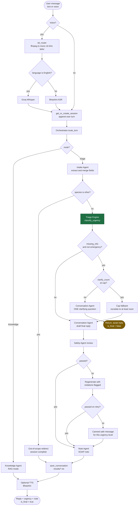

### The Orchestrator's two fast paths

Two cases skip the LLM routing call entirely, because the model demonstrably got them
wrong and each mistake had a real cost:

1. **`status == "awaiting_clarification"`** → always triage. The Conversation Agent
   just asked a triage question; the answer belongs to the same flow.
2. **A short reply with existing symptom context** (4 words or fewer, no `?`, symptoms
   already on file) → always triage. A session's status flips to `complete` after
   *every* final reply, so the next message can be a bare "yes" confirming something
   safety-relevant like a fever, with no `awaiting_clarification` flag protecting it.
   The Orchestrator sees only bare text — it misrouted those to `knowledge`, which then
   answered "I don't have that in the knowledge base" instead of ever triaging the
   detail.

If the routing call fails outright, the fallback is `triage` — better to run the
safety-checked path than let an unclassified message reach the Knowledge Agent.

### The clarifying loop is capped

`MAX_CLARIFYING_QUESTIONS` (default 3) bounds the loop. On hitting the cap with
information still missing, `apply_clarify_cap_fallback()` raises urgency to **at least
`soon`** and produces a final answer. *When in doubt, recommend seeing a vet* beats
staying stuck in a question loop.

Note the ordering: `needs_clarification` also requires `urgency != "emergency"`.
**An emergency is never held back to ask a follow-up question.**

### A voice turn, end to end

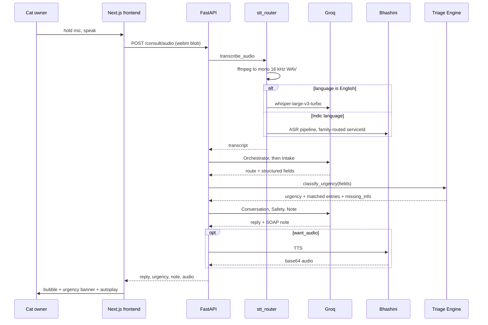

TTS failure is deliberately non-fatal: the text reply already exists, so the turn
returns with a `tts_error` field instead of failing. The frontend also falls back to
showing text whenever `audio_base64` is absent, so a voice-only session with broken
TTS never renders an empty bubble.

---

## 3.1 Speech pipeline

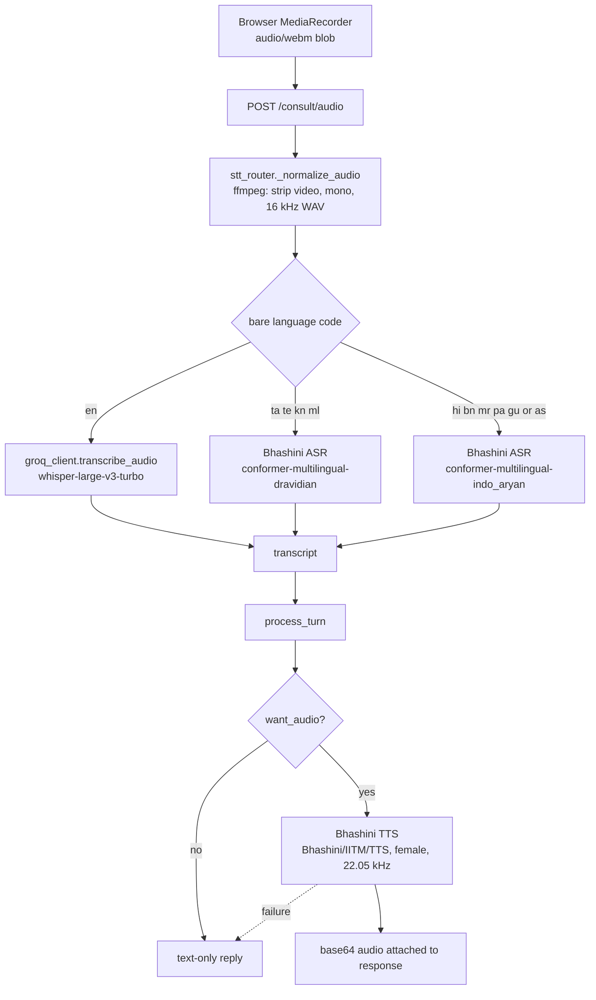

Three details that are easy to lose:

- **ffmpeg is a hard runtime dependency** for voice input. Browsers hand over
  `audio/webm`; both providers want normalized PCM WAV. A missing ffmpeg binary
  surfaces as a `RuntimeError`, not a transcription failure.
- **Bhashini wants bare ISO-639-1 codes.** The rest of the app uses BCP-47-ish codes
  (`hi-IN`), so `bhashini_client` strips the suffix — and remaps `od` → `or`, since the
  frontend's Odia option isn't the real ISO code.
- **TTS always goes to Bhashini,** English included, so the assistant has one
  consistent voice regardless of language.

---

## 4. Session state schema

`session_store.py` holds these as a process-local dict, keyed by `session_id`. The
whole object is what gets passed between agent "nodes", and it is what the Note Agent
reads at the end.

```json
{
  "session_id": "uuid",
  "language_code": "hi-IN",
  "species": "cat",
  "breed": null,
  "age": null,
  "turns": [
    {"role": "user", "text": "...", "timestamp": "2026-08-24T09:14:02+00:00"},
    {"role": "assistant", "text": "...", "timestamp": "..."}
  ],
  "extracted_symptoms": [
    {"symptom": "vomiting", "duration": "since this morning", "severity_cues": []}
  ],
  "urgency": "soon",
  "matched_kb_entries": ["vomiting"],
  "missing_info": [],
  "safety_flags": [],
  "status": "in_progress",
  "clarify_count": 0,
  "followup_note": null,
  "transcript_path": null
}
```

`species` starts as `"cat"` on every session — the Intake Agent only ever overwrites it
to `"other"`, which is the signal `turn_processor` uses to redirect out of triage.

### Session lifecycle

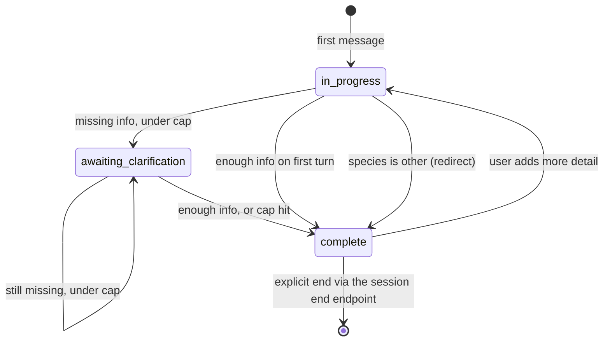

`complete` is not terminal — a user can keep typing, and the same session picks back
up. That is exactly why the Orchestrator needs its short-reply fast path (§3).

**This store is intentionally the weakest link.** It is process-local and in-memory:
restarting the backend drops every live session, and it does not survive more than one
worker. The persisted artifact is the transcript on disk (§6). Swapping in Redis or a
database means changing this one module — the agents only ever see the dict shape.

---

## 4.1 The triage knowledge base — no database, no runtime file reads

`triage_kb.py` bakes the vet-reviewed KB directly into code as a Python dict. Same
grounding as a file or database lookup, zero I/O, nothing to wire up, and it versions
with the code that reads it.

```python
TRIAGE_KB: dict[str, dict] = {
    "vomiting": {
        "label": "Vomiting",
        "typical_triage_level": "varies",   # documentation only — see below
        "questions_to_ask": ["Does the vomit contain hair, food, or fluid?", "..."],
        "red_flags": ["blood in vomit", "distended abdomen", "3+ times in a few hours"],
        "yellow_flags": ["persists past 24 hours"],
        "owner_guidance": "Withhold food a few hours (not water), monitor for repeats.",
    },
    # ... 18 entries total, see §10
}

SYMPTOM_ALIASES: dict[str, str] = {"throwing up": "vomiting", ...}
```

`typical_triage_level` is **documentation only** — the engine never reads it. Urgency is
always derived from actual red/yellow flag matches, per §1.

Each field has exactly one consumer:

| Field | Read by | Used for |
|---|---|---|
| `label` | Triage Engine, Knowledge Agent | Symptom normalization, KB-mode answers |
| `questions_to_ask` | Conversation Agent | Vet-reviewed phrasing for the one clarifying question |
| `red_flags` / `yellow_flags` | Triage Engine | The urgency decision itself |
| `owner_guidance` | Conversation Agent, Note Agent | Interim advice in the reply and the SOAP Plan |
| `typical_triage_level` | *(nothing)* | Human documentation |

### Inside `classify_urgency()`

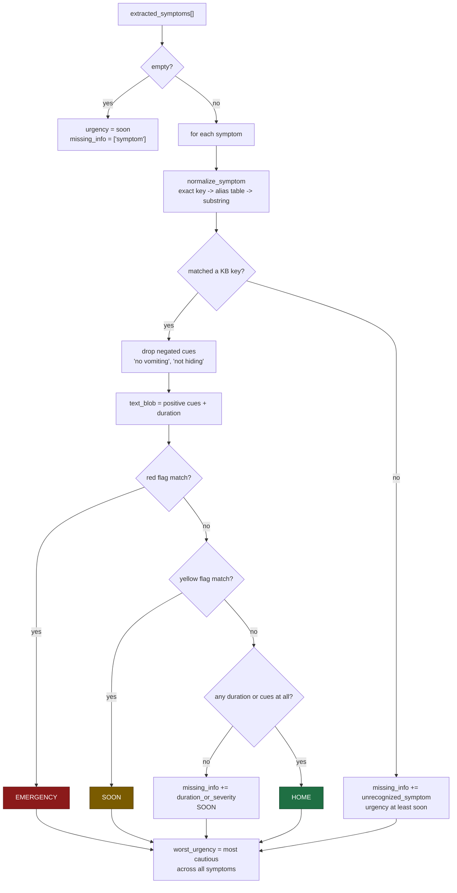

Three matching rules carry real safety weight, and all three exist because of observed
failures:

- **Fuzzy flag matching errs toward sensitivity.** Real phrasing rarely matches a KB
  phrase word for word ("blood" vs. "blood in vomit"), so exact containment falls back
  to significant-word overlap. A missed red flag is far more dangerous than an
  over-cautious one. Generic time words (`hours`, `days`, `morning`) are stopworded
  precisely because they appear in both duration text *and* frequency-based red flags
  like "3+ times in a few hours", which produced false emergencies.
- **Negated cues never match flags.** The Intake Agent is asked to keep denials
  ("no vomiting") because they are useful context for the note — but left unfiltered
  they let a denial trigger the exact flag it denied.
- **Bare-symptom flags use exact matching, not fuzzy.** When a flag is just the
  symptom's own name (`"seizure"` on the seizure entry), reporting it at all is the red
  flag. Fuzzy matching here would let a symptom name self-match phrases like "vomiting
  blood" through a shared word, turning routine reports into emergencies.

Urgency is ranked `home < soon < emergency`, and across multiple symptoms the **most
cautious** level always wins.

---

## 5. RAG: where it belongs and where it doesn't

**For the triage decision: no RAG, and no database.** The Triage Engine stays a
deterministic lookup against the in-code KB. RAG introduces similarity-search fuzziness
into exactly the one decision that must be predictable and auditable.

**Where RAG earns its place: the Knowledge Agent** — general, non-urgent questions
("is it normal for kittens to lose baby teeth?", "how much should a 6-month-old kitten
weigh?"). Different job, different tolerance for fuzziness.

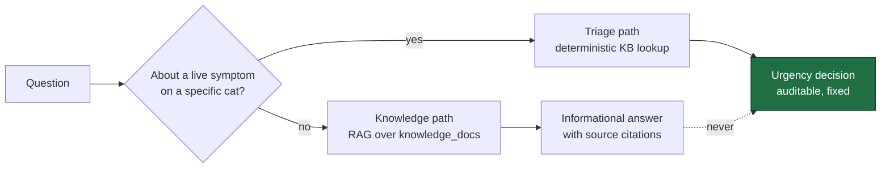

**Two knowledge stores, two retrieval strategies, two different jobs:**

| | Triage KB | RAG store |
|---|---|---|
| Lives in | `triage_kb.py` (code) | `kb_store/` (index.json + vectors.npy) |
| Retrieval | Exact key → alias → substring | Cosine similarity, top-k |
| Feeds | The urgency decision | General Q&A answers only |
| Editable at runtime | No — code change + review | Yes — upload/delete via the UI |
| Can affect urgency | **Yes, exclusively** | **Never** |

Seed corpus: `backend/knowledge_docs/` holds 13 original markdown documents — one per
demo scenario, a cat-toxins reference, and general-care documents (kitten basics,
vaccination schedule, weight and nutrition, dental health, senior cat health, litter
box behavior) covering the non-urgent questions the Knowledge Agent actually fields.
Ingest them with `python scripts/seed_kb.py`.

---

## 6. Saving the conversation to disk

At session end, `transcript.save_conversation()` writes the raw turn-by-turn transcript
to `results/{session_id}_{timestamp}.txt` — separate from the structured SOAP note, and
useful as a debugging and audit trail.

It is called once per completed session — on a final reply, on the out-of-scope
redirect, and from `POST /consult/{id}/end` — never per turn.

`utf-8` encoding is not optional here: these transcripts contain Hindi, Tamil, and other
Indic text, and a platform default encoding silently corrupts non-English characters.

---

## 7. Tool surface

The function-calling surface, and the HTTP endpoints in `app.py` that expose it:

| Function | Module | Endpoint |
|---|---|---|
| `classify_urgency(symptoms, species)` | `triage_engine` | *(internal)* |
| `normalize_symptom(raw)` | `triage_engine` | *(internal)* |
| `run_safety_check(draft)` | `agents/safety` | *(internal)* |
| `generate_followup_note(session)` | `agents/note` | *(internal)* |
| `save_conversation(session)` | `transcript` | `POST /consult/{id}/end` |
| `process_turn(...)` | `turn_processor` | `POST /consult`, `POST /consult/audio` |
| `get_session(id)` | `session_store` | `GET /consult/{id}` |
| `synthesize_speech(text, lang)` | `bhashini_client` | `POST /tts` |
| `ingest_document(name, bytes)` | `rag_store` | `POST /kb/upload` |
| `list_documents()` / `delete_document(id)` | `rag_store` | `GET` / `DELETE /kb/documents` |
| `answer_general_question(q, mode, lang)` | `agents/knowledge` | `POST /kb/ask` |
| — | — | `GET /health` |

`GET /health` reports whether each API key is configured, which is the fastest way to
diagnose a deployment that starts but can't reach a model.

---

## 8. The RAG knowledge store

Implemented in `rag_store.py`, exposed through `/kb/*`, driven from the frontend's
Settings panel. Entirely separate from the triage KB (§4.1, §5).

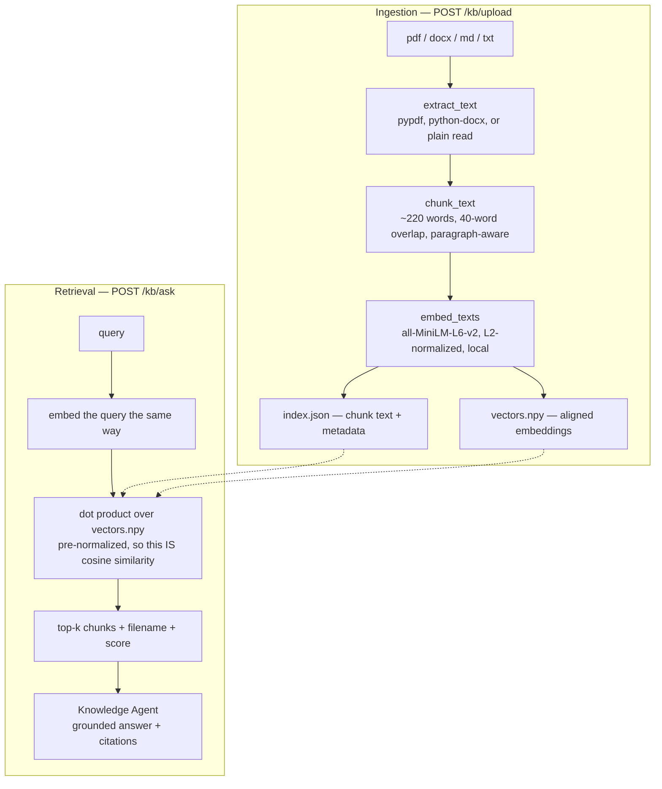

No database server: two flat files on disk. Embeddings run locally via
`sentence-transformers`, so ingestion and retrieval need no API key — only answer
*generation* calls Groq.

### The three answer modes

`POST /kb/ask` takes a `mode`, surfaced as a switch in the Settings panel. This exists
so rule-based and AI-based answering can be compared side by side on the same question.

| Mode | What runs | Model call | Behavior when it can't answer |
|---|---|---|---|
| `kb` | Exact/alias dictionary lookup against `TRIAGE_KB` | **None** | "No exact match" — never guesses |
| `llm` | Model answers from its own knowledge | 1 | May generalize; no citations |
| `rag` | Retrieve top-4 chunks, then answer from those only | 1 | "I don't have that in the knowledge base" |

That last instruction in the RAG prompt is load-bearing — it is what keeps RAG mode
from quietly hallucinating when the uploaded documents don't cover a question.

Both AI modes are explicitly forbidden from issuing an urgency classification. If a
question turns out to describe an active symptom, the prompt directs the user back to a
proper triage conversation instead of answering.

---

## 9. Failure modes and fallbacks

Every external call in this system can fail, and each one has a defined degradation
path. Nothing silently disappears.

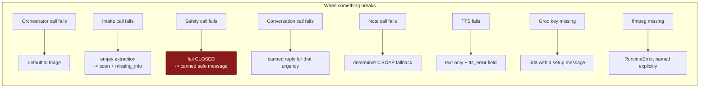

| Layer | Guarantee | How it's enforced |
|---|---|---|
| Urgency decision | Never an LLM judgment | `triage_engine` is pure Python over a static KB |
| Species scope | Non-cats never reach triage | Intake sets `species = "other"` → immediate redirect |
| Draft review | Nothing unreviewed ships | Safety Agent, one regeneration, then a canned message |
| Safety-check outage | An outage can't skip the guardrail | `run_safety_check` **fails closed** — returns not-passed |
| Question loop | Cannot run forever | Capped at 3, then escalate to at least `soon` |
| Emergency handling | Never delayed by a follow-up question | Clarification requires `urgency != "emergency"` |
| SOAP note | Never half-empty | Missing sections backfilled from the deterministic note |
| Voice output | Never blocks the text answer | TTS wrapped, failure logged, `tts_error` returned |

The Note Agent's backfill deserves a note of its own: `chat_json` only raises on
*unparseable* JSON, so a syntactically valid but incomplete response would otherwise
ship a half-empty SOAP note. Each of the four sections is checked and refilled from the
deterministic fallback independently.

---

## 10. Cat-specific health scenarios (demo set)

Not a relabeled species-agnostic KB — this is the research pass identifying where feline
presentation actually changes what "urgent" means. Full entries live in `triage_kb.py`.

| Scenario | Typical level | Why it's different in cats |
|---|---|---|
| **Urinary obstruction** (`urinary_obstruction`) | Emergency | Far more common in male cats (narrow urethra); a blocked cat can reach fatal kidney failure in 24–48h. The highest-stakes entry in the KB. |
| **Loss of appetite** (`not_eating`) | Soon → emergency past 24–48h | Cats, especially overweight ones, can develop hepatic lipidosis from as little as 1–2 days without food — a risk that doesn't apply the same way to other pets. |
| **Vomiting** (`vomiting`) | Varies | The judgment call is separating a normal occasional hairball from a chronic pattern that in cats often signals IBD, hyperthyroidism, or kidney disease. |
| **Diarrhoea** (`diarrhea`) | Soon | Similar to other species, but kittens dehydrate faster than adult cats, so age materially changes urgency. |
| **Breathing difficulty** (`difficulty_breathing`) | Emergency, almost always | Cats don't pant normally the way dogs do — open-mouth breathing at rest is essentially always abnormal, and cats mask respiratory distress until it's severe. |
| **Skin issues** (`skin_irritation`) | Home → soon | Usually flea allergy or stress overgrooming; escalates only with acute allergic signs (facial swelling, hives plus breathing changes). |

Two supporting entries were added for cat-specific reasons, not carried over from a
generic KB:

- **Constipation** — owners frequently can't tell straining-to-urinate from
  straining-to-defecate. These are separate entries, and `constipation`'s guidance
  explicitly defaults to the urinary emergency path whenever there's doubt.
- **Poisoning / toxin ingestion** — expanded with feline-specific toxins: lilies
  (severely nephrotoxic even from pollen or vase water, and not widely known as a
  hazard), permethrin (safe for dogs, toxic to cats — a recurring accidental-poisoning
  source), and onion/garlic.

The remaining ten entries — `fever`, `lethargy`, `limping`, `seizure`,
`bloated_abdomen`, `eye_injury`, `ear_infection`, `coughing`, `pain_vocalizing`,
`trauma_injury` — were localized for feline presentation. For example
`bloated_abdomen` no longer references GDV/bloat, a large-breed-dog condition rare in
cats; a distended feline abdomen more often points to fluid buildup (FIP, heart, or
liver disease), organomegaly, or parasite load.

**18 entries total.** The same content, rewritten in longer explanatory form for
retrieval quality, is seeded into the RAG store as `knowledge_docs/*.md` — a separate
corpus per §5's boundary.

---

## 11. Consultation note format — SOAP

`agents/note.py` writes the end-of-session note in **SOAP** format (Subjective /
Objective / Assessment / Plan), the standard veterinary note structure, so it reads
naturally to both the cat owner and any vet they share it with.

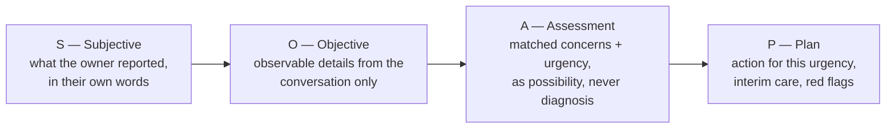

| Section | Source | Constraint |
|---|---|---|
| **Subjective** | `turns`, `extracted_symptoms`, breed/age | Owner's own words, symptoms, duration, severity cues |
| **Objective** | Conversation only | States plainly that no physical exam was performed — never invents findings or vitals |
| **Assessment** | `urgency` + `matched_kb_entries` | Phrased as a possibility or reason to seek care, never a definitive diagnosis |
| **Plan** | `urgency` + `owner_guidance` (§4.1) | Recommended action, interim home care, and the specific signs meaning "stop waiting" |

Like every other LLM output here, the Note Agent is a **summarizer, not a
decision-maker** — it organizes what the deterministic engine and the session state
already established. A fixed non-LLM fallback in the same SOAP shape covers a failed
Groq call, and any individual blank section is backfilled from it (§9).

The frontend renders the note as a distinct message bubble (`kind: "note"`) once
`is_final` is true.

---

## 12. Configuration and deployment

All configuration is env-driven through `config.py`, loaded from `backend/.env`
(template in `.env.example`).

| Variable | Default | Purpose |
|---|---|---|
| `GROQ_API_KEY` | — | Required for every LLM agent and English STT |
| `BHASHINI_API_KEY` | — | Required for Indic STT and all TTS; the app runs text-only without it |
| `*_MODEL` | see §2.1 | Per-agent model override |
| `MAX_CLARIFYING_QUESTIONS` | `3` | Clarifying-loop cap (§3) |
| `RAG_TOP_K` | `4` | Chunks retrieved per RAG answer |
| `RAG_CHUNK_WORDS` / `RAG_CHUNK_OVERLAP_WORDS` | `220` / `40` | Chunking (§8) |
| `EMBEDDING_MODEL_NAME` | `all-MiniLM-L6-v2` | Local embedding model |
| `CORS_ORIGINS` | localhost:3000, :5500 | Comma-separated allowed origins |
| `RESULTS_DIR` / `KB_STORE_DIR` | `results` / `kb_store` | On-disk paths |
| `PORT` | `8000` | Injected by most PaaS hosts |

**Host binding is derived, not hardcoded.** The presence of `PORT` is used as the
"we're deployed" signal: `HOST` becomes `0.0.0.0` and reload is disabled. Locally,
`python app.py` binds `127.0.0.1` with reload on. This matters — binding `127.0.0.1` in
a container accepts only loopback connections and is silently unreachable from outside,
which is what previously surfaced as a 404 on Railway (not a routing or CORS problem).

The `Procfile` seeds the RAG store before starting the server, so a fresh deployment
comes up with `knowledge_docs/` already ingested:

```
web: python scripts/seed_kb.py && python app.py
```

The frontend reads `NEXT_PUBLIC_API_BASE_URL` (default `http://127.0.0.1:8000`).

---

## 13. Testing

```bash
cd backend
python -m unittest discover -s tests
```

- `tests/test_triage_engine.py` — the safety-critical surface. It runs with no network,
  no API key, and no mocks, because the engine has no dependencies to mock. Every rule
  in §4.1 is asserted here: red-flag escalation, negated-cue filtering, bare-symptom
  flags, multi-symptom worst-case selection, and unrecognized-symptom handling.
- `tests/test_orchestrator.py` — the routing fast paths from §3, which are pure logic
  and reachable without an LLM call.

The agent modules themselves are thin prompt wrappers over `groq_client`; the behavior
worth pinning down in tests is the deterministic logic they sit around.
