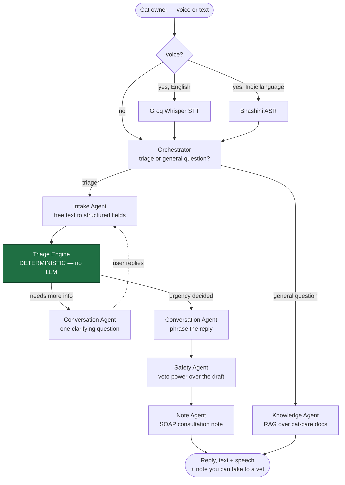

# Pet AI — Feline Triage Assistant

A multi-agent AI chatbot that helps cat owners figure out how urgently their
cat needs veterinary care. Owners describe symptoms by text or voice (in
English or one of ten Indian languages), and the app walks them through a
short intake conversation, classifies urgency using a deterministic,
vet-reviewed rules engine (never an LLM guess), and replies with guidance —
plus a SOAP-format consultation note they can bring to a vet.

**Scope: cats only**, by design — see [ARCHITECTURE.md](ARCHITECTURE.md) for
why several symptoms mean something different in a cat than in a dog.

## How it works



- **Triage Engine** — a plain deterministic Python function, not an LLM call.
  Urgency (emergency / soon / home) is decided by a vet-reviewed knowledge
  base lookup, so the one safety-critical decision in the system is fixed
  and auditable, not a model's best guess.
- **Everything else** is a small roster of Groq-hosted LLM agents that
  handle the conversational parts: extracting structured symptoms from
  free text, phrasing replies naturally in the user's language, and a
  Safety Agent that reviews every draft reply before it goes out.
- **Voice in** routes by language: English goes to Groq's Whisper (faster and
  cheaper, and English doesn't need Indic-specific models), while Hindi,
  Tamil, Telugu, Kannada, Malayalam, Marathi, Bengali, Gujarati, Punjabi,
  and Odia go to Bhashini's ASR. **Voice out** is Bhashini for every
  language, so the assistant keeps one consistent voice.
- **A separate RAG knowledge base** answers general, non-urgent cat-care
  questions ("is it normal for kittens to lose baby teeth?") — kept
  deliberately apart from the triage KB so general Q&A can never influence
  an urgency decision.

Full design rationale, the agent roster, the session-state schema, and the
cat-specific triage knowledge base are documented in
[ARCHITECTURE.md](ARCHITECTURE.md).

## Tech stack

| | |
|---|---|
| Backend | FastAPI (Python), Groq (LLM agents), Bhashini (Indic STT/TTS), `sentence-transformers` (local RAG embeddings) |
| Frontend | Next.js 16, React 19, Tailwind CSS 4 |

## Prerequisites

- Python 3.12+
- Node.js 20+
- [ffmpeg](https://ffmpeg.org/download.html) on your `PATH` — browser audio arrives as
  WebM and is normalized to 16 kHz mono WAV before transcription (voice input only)
- A [Groq API key](https://console.groq.com)
- A [Bhashini API key](https://bhashini.gov.in) (for Indic voice input and all voice output — the app runs text-only without one)

## Clone

```bash
git clone https://github.com/GuruAswinidath/Pet-AI.git
cd Pet-AI
```

## Backend setup

```bash
cd backend
python -m venv .venv

# Windows
.venv\Scripts\activate
# macOS/Linux
source .venv/bin/activate

pip install -r requirements.txt
cp .env.example .env   # then fill in GROQ_API_KEY and BHASHINI_API_KEY

# optional: seed the RAG knowledge base from backend/knowledge_docs/
python scripts/seed_kb.py

python app.py
```

The API runs at `http://127.0.0.1:8000` (`/health` should return
`{"status": "ok", ...}`).

## Frontend setup

In a separate terminal:

```bash
cd frontend
npm install
cp .env.local.example .env.local   # points at the backend, defaults to 127.0.0.1:8000
npm run dev
```

Open [http://localhost:3000](http://localhost:3000).

## Running backend tests

```bash
cd backend
python -m unittest discover -s tests
```

## API surface

| Endpoint | Purpose |
|---|---|
| `GET /health` | Liveness plus whether each API key is configured |
| `POST /consult` | Send a text message, get back a triage turn |
| `POST /consult/audio` | Same, from an uploaded audio clip (Groq for English, Bhashini otherwise) |
| `GET /consult/{session_id}` | Read back session state |
| `POST /consult/{session_id}/end` | Close a session and write its transcript |
| `POST /tts` | Standalone text-to-speech (e.g. a "replay" button) |
| `POST /kb/upload`, `GET /kb/documents`, `DELETE /kb/documents/{id}` | Manage the general-Q&A RAG knowledge base |
| `POST /kb/ask` | Ask a general cat-care question in one of three modes: `kb` (plain rules lookup, no model), `llm` (model only), or `rag` (grounded in your uploaded docs) |
